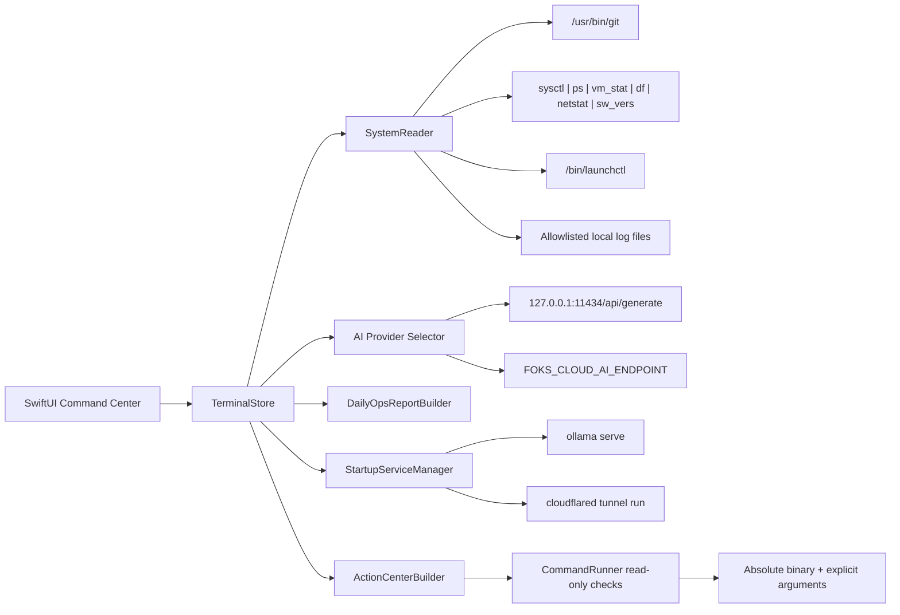

# FOKS Terminal Next Generation

## Product Analysis

FOKS Terminal is a local macOS operational command center. Its job is to make project, system, log, launchd, and AI-assisted diagnostic state visible without taking ownership of fixes. The product stays Apple-native, SwiftUI-first, local-first, and read-only by default.

The implemented next-generation baseline adds:

- Dashboard with global health, active issues, system pressure, incidents, project overview, and AI insight preview.
- Projects Center with inventory, git state, dirty preview, health score, last activity, dependency markers, and warnings.
- System Center with CPU, memory, disk, network, uptime, hardware, processes, LaunchAgents, and LaunchDaemons.
- Logs Center with search, severity, category, time, and project filters.
- Action Center with prioritized manual actions.
- Fix Queue with explicit binary/argument manual command cards and read-only check buttons.
- Daily Ops Report export as Markdown or plain text.
- In-memory health trend points per refresh.
- Advisory-only AI integration with a provider dropdown: local Ollama by default, or explicit environment-configured cloud analysis.
- Startup services for the packaged `.app`: local Ollama is checked/started first, then the configured Cloudflare Tunnel is checked/started.

## Missing Requirements

The current implementation intentionally does not include autonomous remediation, credential storage, cloud telemetry, destructive maintenance, or background orchestration. Those would violate the stated safety model.

Known future gaps:

- Historical trend persistence is not stored yet; current trend tracking is in-memory for the active app session.
- Log timestamps are not parsed from every log format; entries use read-time when no structured timestamp is known.
- LaunchDaemon runtime inspection is limited to relevant local labels to avoid dumping macOS internals.
- `.app` signing/notarization is local ad hoc packaging, not App Store distribution.

## System Architecture

Layering is preserved:

Core Scripts -> Interfaces -> Triggers -> Intelligence -> Monitoring

Implementation layers:

- Core Layer: models, parsers, scoring, explicit command runner.
- Readers Layer: git, sysctl, ps, vm_stat, df, netstat, launchctl, local files.
- Integrations Layer: local Ollama HTTP, Cloudflare Tunnel process startup, launchd, git, process and resource tools.
- Dashboard Layer: snapshot generation, incident aggregation, action prioritization, report generation.
- AI Layer: diagnostic bundle builder, provider-specific prompt constraints, local Ollama request, optional cloud HTTPS request, result rendering.
- UI Layer: SwiftUI NavigationSplitView modules with native controls and keyboard shortcuts.

## Component Diagram



## Project Structure

```text
FOKS_BLOOMBERG/
  Package.swift
  Sources/
    FOKSTerminalApp/
      FOKSTerminalApp.swift
      TerminalView.swift
    FOKSTerminalCore/
      AIAdvisor.swift
      ActionCenter.swift
      DailyOpsReport.swift
      Models.swift
      Parsers.swift
      Shell.swift
      SystemReader.swift
  Tests/
    FOKSTerminalCoreTests/
      FOKSTerminalCoreTests.swift
  config/
    projects.json
  docs/
    NEXT_GENERATION_ARCHITECTURE.md
  packaging/
    FOKSTerminal-Info.plist
  scripts/
    build_app.sh
    validate.sh
```

## Data Flow

1. User launches the app.
2. `TerminalStore` runs startup services: local AI first, then Cloudflare Tunnel.
3. User clicks Refresh or the launch task continues.
4. `TerminalStore` calls `SystemReader.readDashboard()`.
5. Readers gather local state through explicit commands and file reads.
6. Parsers convert raw output into typed models.
7. `DashboardSnapshot` computes health scores and active issue counts.
8. `IncidentAggregator` creates incidents from missing projects, launchd failures, severe logs, and system pressure.
9. `ActionCenterBuilder` creates prioritized manual actions and typed command cards.
10. SwiftUI renders the selected module.
11. Optional AI analysis sends a compact diagnostic bundle to local Ollama by default, or to Cloud AI only after the user selects it and environment configuration is present.
12. Optional Run Check executes a predeclared read-only command through `CommandRunner`.

## Integration Design

- Git: `/usr/bin/git -C <path>` for status, branch, remote, upstream, divergence, last activity.
- Launchctl: `/bin/launchctl list` and `launchctl print` for relevant labels only.
- Sysctl: hardware model, CPU, memory, logical/physical cores.
- ps: process watchlist and CPU calculation.
- vm_stat: memory pressure calculation.
- df: startup disk usage.
- netstat: network byte counters.
- sw_vers: macOS version.
- Ollama: `http://127.0.0.1:11434/api/generate` with no stored credentials.
- Startup Ollama: `/opt/homebrew/bin/ollama serve`, guarded by `http://127.0.0.1:11434/api/tags` health checks.
- Cloudflare Tunnel: `/opt/homebrew/bin/cloudflared tunnel --no-autoupdate run <name>` from `config/startup_services.json`; the app does not store tunnel credentials.
- Cloud AI: OpenAI-compatible HTTPS chat completions endpoint configured through `FOKS_CLOUD_AI_ENDPOINT`, `FOKS_CLOUD_AI_API_KEY`, and `FOKS_CLOUD_AI_MODEL`; missing or invalid configuration fails before request submission.

## Security Model

Security risks and mitigations:

- Shell injection: `CommandRunner` rejects non-absolute executables and known shells; commands use `Process` with argument arrays.
- Hidden execution: refreshes are read-only and visible in status; only Run Check executes, and checks are predeclared.
- Startup execution: app launch starts only configured services, in visible dashboard status rows, using explicit binaries and no shell snippets.
- Destructive action: no write, delete, reset, kill, unload, bootstrap, or fix buttons are implemented.
- Credential exposure: no API keys, no tokens, no password storage.
- Cloud leakage: local Ollama remains the default; cloud AI is opt-in from the Analyze dropdown and requires explicit environment configuration.
- Log overexposure: log ingestion is bounded, local, and summarized by severity/filter.
- macOS privilege creep: the app uses current-user read permissions only.
- Command drift: manual commands are represented as typed `ManualCommand` records with executable, arguments, and intent.

## Data Integrity Model

No fake metrics are allowed.

- Hardware is read live from `sysctl` and `sw_vers`; there is no hardcoded target profile in runtime UI.
- Project inventory comes only from `config/projects.json`; if that file is missing or invalid, the app shows zero configured projects instead of fallback projects.
- System metrics come only from successful local commands. If a command fails, the UI and reports show `unavailable`, not `0%`.
- Logs come only from real local log files. Missing logs render as an empty log view, not as synthetic warning records.
- Health scores are computed from the current snapshot. An empty or unavailable system snapshot scores `0`, not healthy.
- AI summaries are advisory interpretations of the real diagnostic bundle and are never treated as source-of-truth measurements.

## Performance Strategy

- Project reads use Swift task groups for concurrent inventory refresh.
- System reads use Swift async lets for parallel command execution.
- Command timeouts prevent hanging refreshes.
- Log ingestion is capped per file and capped globally.
- LaunchDaemon inspection is filtered to operationally relevant labels.
- UI renders snapshot data instead of streaming raw command output.
- The model supports hundreds of projects by avoiding recursive scans and heavyweight dependency resolution.

## UI/UX Design

The UI uses native macOS navigation:

- Sidebar modules: Dashboard, Projects, System, Logs, Action Center, Fix Queue, Daily Report.
- Top bar: health pills, AI provider dropdown, local AI model picker when local is selected, Analyze, Refresh, theme, font scale.
- Dashboard: startup service status rows for local AI and Cloudflare Tunnel.
- Dashboard: compact operational status without raw dumps.
- Projects Center: inventory list plus detail inspector.
- System Center: metrics, hardware, process watchlist, launchd tables.
- Logs Center: searchable actionable filters with raw dumps hidden by default.
- Action Center: prioritized operational issues.
- Fix Queue: manual command cards plus read-only validation checks.
- Daily Report: Markdown/plain text export and clipboard action.

## Full Swift Project Structure

Production code is split into:

- `Models.swift`: project, system, launchd, log, incident, action, command, report models.
- `Shell.swift`: timeout command runner with absolute-path and shell-execution guards.
- `Parsers.swift`: git, process, launchctl, resource, dependency, log, and incident parsing.
- `SystemReader.swift`: local snapshot reader.
- `ActionCenter.swift`: prioritized issue and manual command generation.
- `DailyOpsReport.swift`: Markdown/plain text report generation.
- `AIAdvisor.swift`: diagnostic bundle plus local Ollama and explicit cloud advisor requests.
- `StartupServices.swift`: launch-time local AI and Cloudflare Tunnel service checks/startup.
- `TerminalView.swift`: SwiftUI command center.

## Complete Implementation Plan

Completed phase:

1. Type the safety model around explicit commands.
2. Add health scoring, resource metrics, incidents, LaunchDaemons, dependency markers, and bounded logs.
3. Expand Action Center, Fix Queue, Daily Ops Report, and AI bundle.
4. Replace the single dense screen with a native multi-module command center.
5. Add local `.app` packaging script and validation path.

Next implementation phase:

1. Add persistent trend snapshots under `~/Library/Application Support/FOKSTerminal`.
2. Parse structured timestamps from known FoKS JSONL logs.
3. Add user-editable project inventory UI that writes only after explicit confirmation.
4. Add optional local notification summaries for critical incidents.

## Production Code

The production code lives in `Sources/` and is buildable with Swift Package Manager:

```bash
cd /Users/giovannini_nuovo/Library/Mobile Documents/com~apple~CloudDocs/Documents/GitHub/FOKS_BLOOMBERG
swift build
swift run FOKSTerminal
```

Build a local `.app`:

```bash
cd /Users/giovannini_nuovo/Library/Mobile Documents/com~apple~CloudDocs/Documents/GitHub/FOKS_BLOOMBERG
./scripts/build_app.sh
open /Users/giovannini_nuovo/Library/Mobile Documents/com~apple~CloudDocs/Documents/GitHub/FOKS_BLOOMBERG/dist/FOKSTerminal.app
```

## Testing Strategy

Current tests cover:

- Project config decoding.
- Git health classification.
- Dirty file and divergence parsing.
- Process parsing.
- LaunchAgent parsing and failure analysis.
- Diagnostic bundle content.
- Command timeout handling.
- Command runner rejection of shell/non-absolute execution.
- Action Center prioritization and explicit command cards.
- Daily Ops Report output.
- Resource parser and log classifier behavior.

Validation command:

```bash
cd /Users/giovannini_nuovo/Library/Mobile Documents/com~apple~CloudDocs/Documents/GitHub/FOKS_BLOOMBERG
./scripts/validate.sh
```

## Deployment Strategy

Local deployment only:

1. Build release binary with SwiftPM.
2. Assemble `dist/FOKSTerminal.app`.
3. Run locally with `open dist/FOKSTerminal.app`.
4. Optional manual copy to `/Applications` after validation.

No Docker, Kubernetes, cloud build, SaaS dependency, or hosted backend is needed.

## Risks and Mitigations

- Large project lists can slow refresh: project reads are concurrent and bounded by command timeouts.
- Large logs can flood memory: ingestion is per-file and global capped.
- AI suggestions can be unsafe: prompts forbid execution/destructive actions, and the app never executes AI output.
- Command cards could drift: cards store binary and arguments separately.
- Launchd output format can vary: parser degrades to configured/unknown state instead of failing refresh.
- Dependency markers can false-positive: they are warnings, not critical failures.

## Future Roadmap

- Trend store with rolling 7/30 day health history.
- Config editor with explicit preview/diff before saving.
- Known-project log adapters for structured JSONL parsing.
- Local notification opt-in for critical incidents.
- App signing with a local Developer ID if distribution leaves this machine.
- Optional Shortcuts integration for opening reports, not executing fixes.
